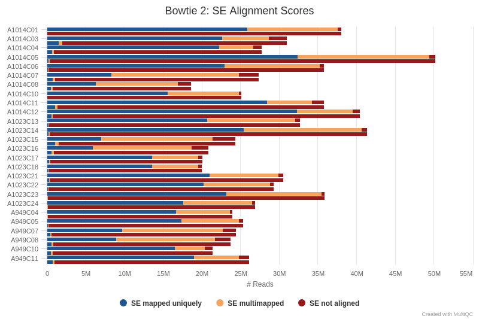
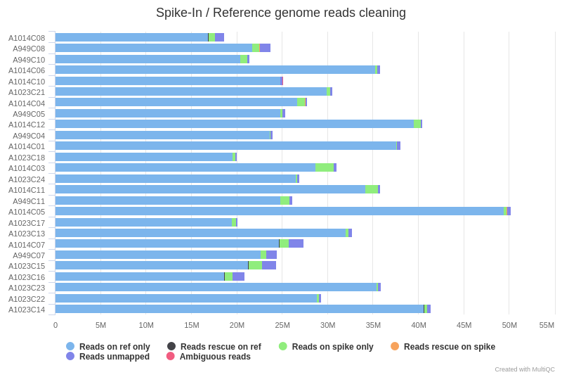
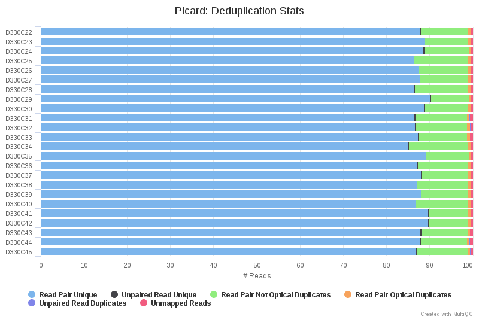
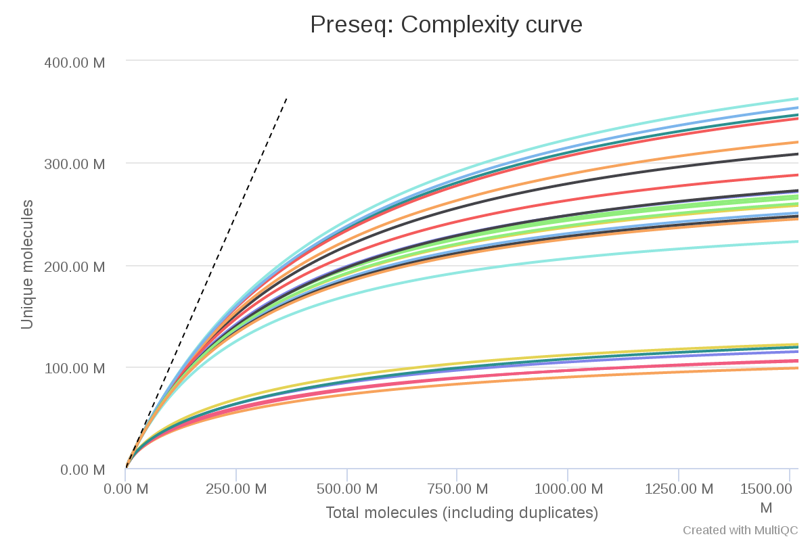
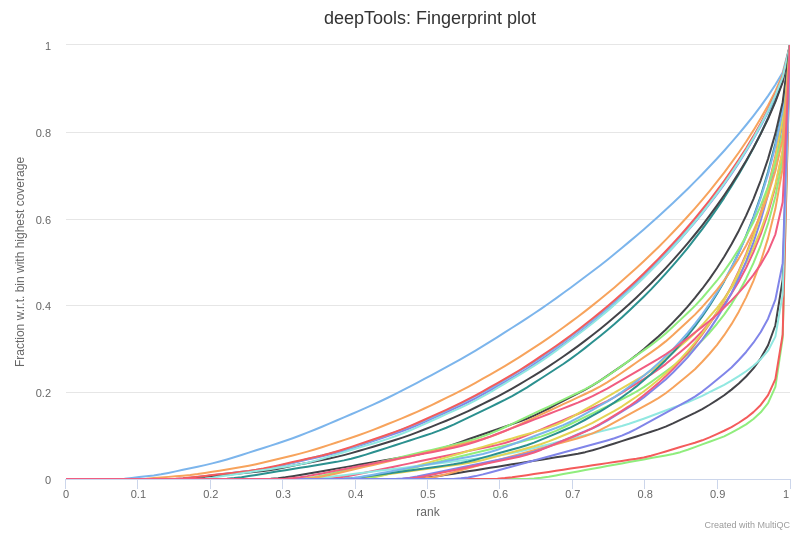
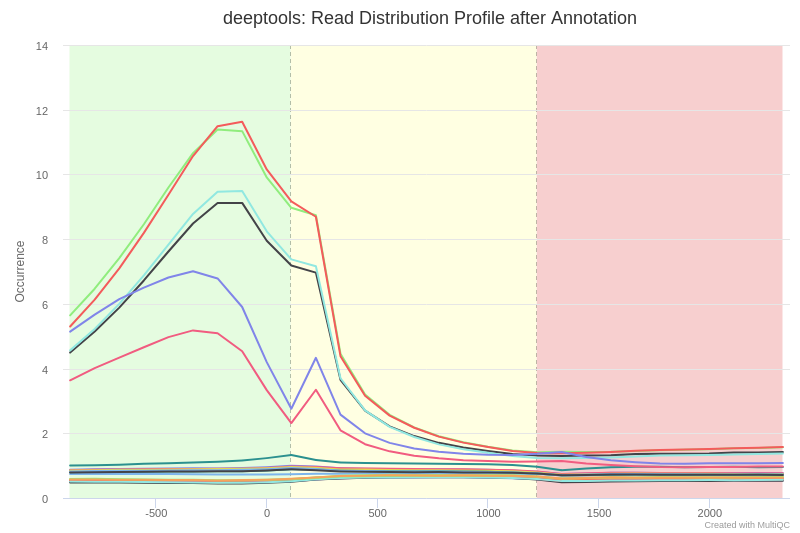
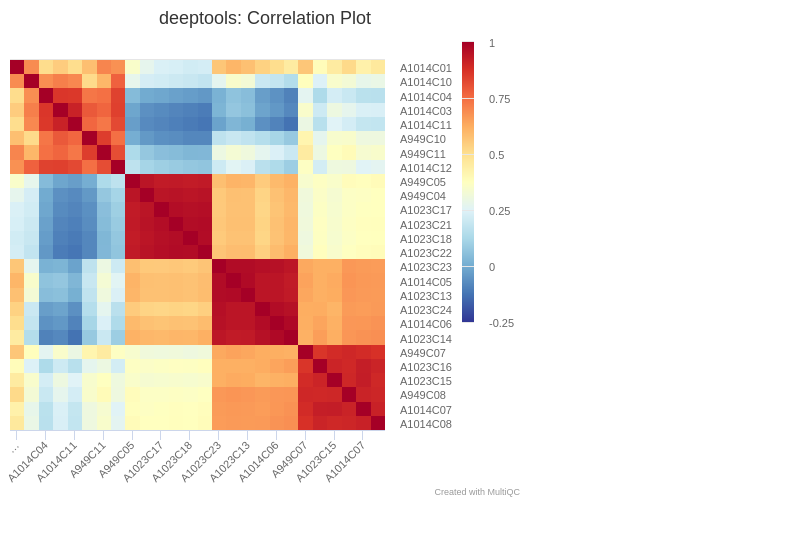
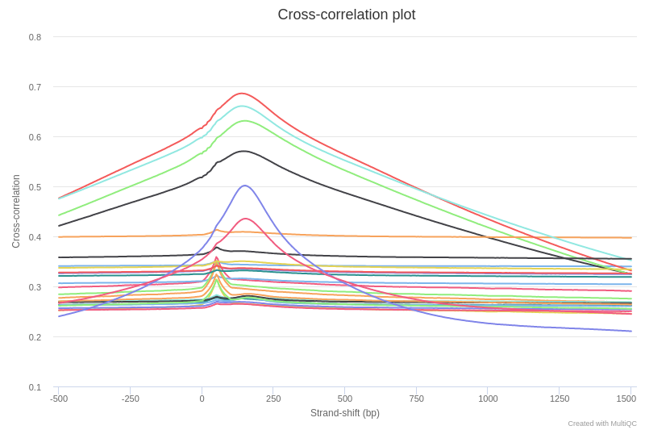
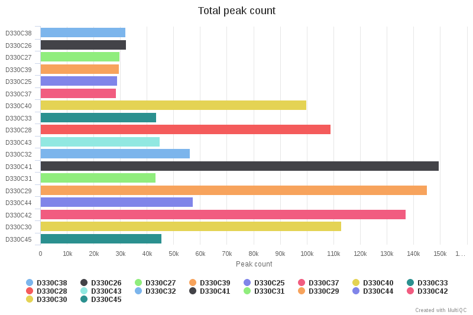
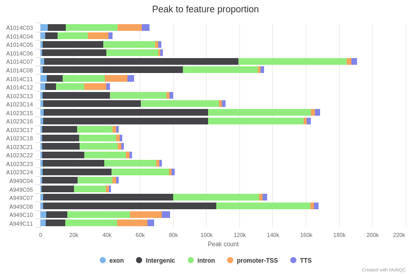

# Outputs

This document describes the output produced by the pipeline. Most of the plots are taken from the MultiQC report, which summarises results at the end of the pipeline.

## Pipeline overview
The pipeline is built using [Nextflow](https://www.nextflow.io/)
and processes ChIP-seq data using the steps presented in the main README file.  
Briefly, its goal is to process ChIP-seq data for any protocol, with or without control samples, and with or without spike-ins.

The directories listed below will be created in the output directory after the pipeline has finished. 

## Sequencing quality

### FastQC
[FastQC](http://www.bioinformatics.babraham.ac.uk/projects/fastqc/) gives general quality metrics about your reads. It provides information about the quality score distribution across your reads, the per base sequence content (%T/A/G/C). You get information about adapter contamination and other overrepresented sequences.

For further reading and documentation see the [FastQC help](http://www.bioinformatics.babraham.ac.uk/projects/fastqc/Help/).

**Output directory: `fastqc`**

* `sample_fastqc.html`
  * FastQC report, containing quality metrics for your untrimmed raw fastq files
* `zips/sample_fastqc.zip`
  * zip file containing the FastQC report, tab-delimited data file and plot images

## Reads mapping

### Alignment

Different tools can be used for read alignment (`STAR`, `BWA-mem`, `Bowtie2`). The mapping statistics (`Total Reads`, `Aligned Reads`, `Unique Reads`, `Multiple Reads`) are also presented in the main summary table.

> **NB:** that by default, one alignment is randomly reported in case of multiple mapping sites. If necessary, those reads can be filtered using the `--mapq` option. In addition, in case of paired-end sequencing reads, singleton are discarded from the analysis

**Output directory: `mapping`**

* `sample.bam`
  * Aligned reads. Available only if (`--saveAlignedIntermediates`) is used.
* `sample_sorted.bam`
  * Aligned reads sorted by chromosome position. Available only if (`--saveAlignedIntermediates`) is used.
* `sample_sorted.bam.bai`
  * Index of aligned and sorted reads. Available only if (`--saveAlignedIntermediates`) is used.

The mapping statistics are presented in the MultiQC report as follows.  
In general, we expect more than 80% of aligned reads. Samples with less than 50% of mapped reads should be further investigated, and check for adapter content, contamination, etc.

### Spike-in

In the case of spike-in data, reads are aligned both on the reference and on the spike genome (`--spike`).  
Alignments are then compared for a given sample in order to extract reference and spike-in specific BAM files.

The number of reads aligned to the spike-in genome are then used to calculate a scaling factor for each sample. This scaling factor will be then applied to generated spike-in normalized `bigwig`
 files.
 
**Output directory: `mapping`**
  * `*_spike.bam` : Spike-in alignment files
  
**Output directory: `spike`**
 * `*_clean.bam` : Alignment file reads aligned on reference genome only
 * `*_clean_spike.bam` : Alignment file with reads aligned on spike genome only
  
  >**NB:** Note that by default, spike-in data with less than 1% of reads are discarded from the analysis, to avoid computational error due to low read number.

### Duplicates

[Picard MarkDuplicates](https://broadinstitute.github.io/picard/command-line-overview.html) is used to mark and remove the duplicates. 
The results are presented in the `General Metrics` table. Duplicate reads are **removed** by default from the aligned reads to mitigate for fragments in the library that may have been sequenced more than once due to PCR biases. There is an option to keep duplicate reads with the `--keepDups` parameter but its generally recommended to remove them to avoid the wrong interpretation of the results.	

**Output directory: `mapping`**

* `sample_filtered.bam`
  * Aligned reads after filtering (`--mapq`, `--keepDups`)
  * `sample_filtered.bam.bai`
    * Index of aligned reads after filtering
	
From our experience, a ChIP-seq sample with less than 25% of duplicates is usually of good quality. Samples with more than 50% of duplicates should be interpreted with caution.

## Quality controls

From the filtered and aligned reads files, the pipeline then runs several quality control steps presented below.

### Sequencing complexity

The [Preseq](http://smithlabresearch.org/software/preseq/) package is aimed at predicting and estimating the complexity of a genomic sequencing library, equivalent to predicting and estimating the number of redundant reads from a given sequencing depth and how many will be expected from additional sequencing using an initial sequencing experiment. The estimates can then be used to examine the utility of further sequencing, optimize the sequencing depth, or to screen multiple libraries to avoid low complexity samples. The dashed line shows a perfectly complex library where total reads = unique reads. Note that these are predictive numbers only, not absolute. The MultiQC plot can sometimes give extreme sequencing depth on the X axis - click and drag from the left side of the plot to zoom in on more realistic numbers.

**Output directory: `preseq`**

* `sample_ccurve.txt`
  * Preseq expected future yield file.

### Fingerprint

[deepTools](https://deeptools.readthedocs.io/en/develop/content/list_of_tools.html) plotFingerprint is a useful QC for ChIP-seq data in order to see the relative enrichment of the IP samples with respect to the controls on a genome-wide basis. The results, however, are expected to look different for example when comparing narrow marks such as transcription factors and broader marks such as histone modifications (see [plotFingerprint docs](https://deeptools.readthedocs.io/en/develop/content/tools/plotFingerprint.html)).

**Output directory: `deepTools/fingerprintQC/`**

* `*.plotFingerprint.pdf`, `*.plotFingerprint.qcmetrics.txt`, `*.plotFingerprint.raw.txt`: plotFingerprint output files.

### Read distribution

The results from deepTools plotProfile gives you a quick visualisation for the genome-wide enrichment of your samples at the TSS, and across the gene body. During the downstream analysis, you may want to refine the features/genes used to generate these plots in order to see a more specific condition-related effect.

> **NB:** Note that when very different profiles (active and repressive histone marks) are presented in the same plots, it is usually difficult to see any enrichment of the repressive marks.

**Output directory: `deepTools/computeMatrix/`**

*  * `*.computeMatrix.mat.gz`, `*.computeMatrix.vals.mat.tab`, `*.plotProfile.pdf`: plotProfile output files

### Sample correlation

The read coverages for entire genome is first calculated using [deepTools](https://deeptools.readthedocs.io/en/develop/content/list_of_tools.html) multiBamSummary and all BAM files. Bins of 10kb are used. Then, the Spearman correlations between all coverage profiles are calculated and presented as a heatmap using the plotCorrelation tool.

  

**Output directory: `deepTools/correlationQC/`**

* `bams_correlation.pdf`,`bams_correlation.tab`: plotProfile output files

### Strand-shift correlation plot

[phantompeakqualtools](https://github.com/kundajelab/phantompeakqualtools) plots the strand cross-correlation of aligned reads for each sample. In a strand cross-correlation plot, reads are shifted in the direction of the strand they map to by an increasing number of base pairs and the Pearson correlation between the per-position read count for each strand is calculated. Two cross-correlation peaks are usually observed in a ChIP experiment, one corresponding to the read length ("phantom" peak) and one to the average fragment length of the library. The absolute and relative height of the two peaks are useful determinants of the success of a ChIP-seq experiment. A high-quality IP is characterized by a ChIP peak that is much higher than the "phantom" peak, while often very small or no such peak is seen in failed experiments.

Normalized strand coefficient (**NSC**) is the normalized ratio between the fragment-length cross-correlation peak and the background cross-correlation. NSC values range from a minimum of 1 to larger positive numbers. 1.1 is the critical threshold. Datasets with NSC values much less than 1.1 tend to have low signal to noise or few peaks (this could be biological e.g. a factor that truly binds only a few sites in a particular tissue type OR it could be due to poor quality).

Relative strand correlation (**RSC**) is the ratio between the fragment-length peak and the read-length peak. RSC values range from 0 to larger positive values. 1 is the critical threshold. RSC values significantly lower than 1 (< 0.8) tend to have low signal to noise. The low scores can be due to failed and poor quality ChIP, low read sequence quality and hence lots of mis-mappings, shallow sequencing depth (significantly below saturation) or a combination of these. Like the NSC, datasets with few binding sites (< 200), which is biologically justifiable, also show low RSC scores.

The NSC and RSC values are reported in the `General Metrics` table. We then applied the threshold from the [ENCODE guidelines](https://www.ncbi.nlm.nih.gov/pmc/articles/PMC3431496/) which usually considers as low quality samples, the experiments with a NSC < 1.1 or RSC < 0.8.

> **NB:** Note that the interpretation of the strand-shift cross correlation may vary according to the type of experiments. For instance, repressive histone marks with broad domains such as H3K27me3, usually have low NSC/RSC values.

## BigWig tracks

The [bigWig](https://genome.ucsc.edu/goldenpath/help/bigWig.html) format is in an indexed binary format useful for displaying dense, continuous data in Genome Browsers such as the [UCSC](https://genome.ucsc.edu/cgi-bin/hgTracks) and [IGV](http://software.broadinstitute.org/software/igv/). This mitigates the need to load the much larger BAM files for data visualisation purposes which will be slower and result in memory issues. The coverage values represented in the bigWig file can also be normalised in order to be able to compare the coverage across multiple samples - this is not possible with BAM files. The bigWig format is also supported by various bioinformatics software for downstream processing such as meta-profile plotting.

Note that the bigwig files are normalized using the total number of reads per bin (RPGC = number of reads per bin / scaling factor for 1x average coverage)

**Output directory: `bigWig`**

* `sample_rpgc.bigwig` : bigwig files

If the `--spike` option is specified, reads aligned on the spike genome are used to calculate a scaling factor.  
The factor is then used to normalize and generate new `bigwig` files.

**Output directory: `bigWigSpike`**

* `*.sf` : scaling factor calculated by DESeq2
* `*_spikenorm.bigwig`: spike-normalized bigwig files

## Counts

The [featureCounts](http://bioinf.wehi.edu.au/featureCounts/) tool is used to count the number of reads relative to the gene and promoters across all of the samples. This essentially generates a file containing a matrix where the rows represent the features, the columns represent all of the samples in the experiment, and the values represent the raw read counts.
The promoters are defined as the regions starting +/- `--tssSize 2000` upstream/downstream the transcription start sites.

**Output directory: `featCounts`**
  * `.csv`: count table for all samples

## Peak calling

Starting from this point, all downstream analysis require a `--design` file.  
This file is used to define pairs of chip/controls files, as well as the type of peak calling to do (`sharp`, `broad`, `very-broad`).
Without the design file, these steps are ignored.

According to the defined peak type, several tools are proposed :

* [MACS2](https://github.com/taoliu/MACS) is one of the most popular peak-calling algorithms for ChIP-seq data. Two modes are available in order to either call `sharp` peaks such as transcription factor or active histone marks (H3K27ac, H3K4me3, etc.), or broad peaks such as repressive histone marks (H3K9me3, etc.). See [MACS2 outputs](https://github.com/taoliu/MACS#output-files) for a description of the output files generated by MACS2.
* [Epic2](https://github.com/biocore-ntnu/epic2) was designed to call larger domain (very broad domain) and is derived from the popular `SICER` peak caller. For repressive marks such as H3K27me3, it usually gives better results than MACS2.

**Output directory: `peakCalling`**
   * `*.xls`, `*.broadPeak` or `*.narrowPeak`, `*summits.bed`: peak calling output files - the files generated will depend on the peak type (`sharp`, `broad`, `very-broad`)
   
In any case, the number of called peaks is available in the MultiQC report, as well as the FRIP score (Fraction of Reads in Peaks). 

[HOMER annotatePeaks.pl](http://homer.ucsd.edu/homer/ngs/annotation.html) is used to annotate the peaks relative to known genomic features. HOMER is able to use the `--gtf` annotation file which is provided to the pipeline. Please note that some of the output columns will be blank because the annotation is not provided using HOMER's in-built database format. However, the more important fields required for downstream analysis will be populated i.e. *Annotation*, *Distance to TSS* and *Nearest Promoter ID*.

## MultiQC
[MultiQC](http://multiqc.info) is a visualisation tool that generates a single HTML report summarising all samples in your project. Most of the pipeline QC results are visualised in the report and further statistics are available in within the report data directory.

The pipeline has special steps which allow the software versions used to be reported in the MultiQC output for future traceability.

**Output directory: `results/multiqc`**

* `chipseq_report.html`
  * MultiQC report - a standalone HTML file that can be viewed in your web browser
* `multiqc_data/`
  * Directory containing parsed statistics from the different tools used in the pipeline

For more information about how to use MultiQC reports, see http://multiqc.info
